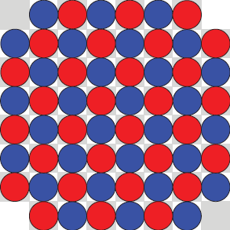
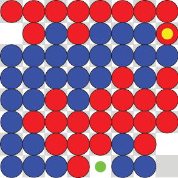
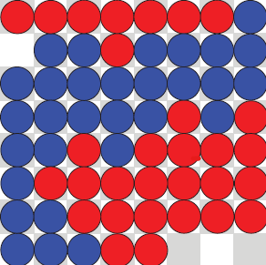
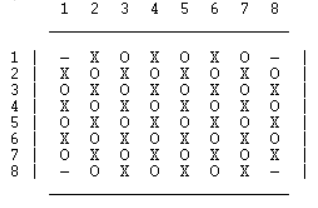
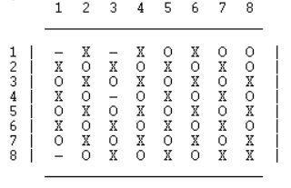
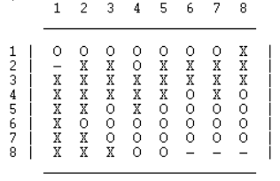
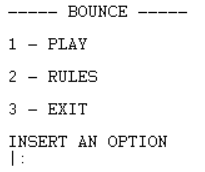

# Bounce

## PFL Practical Work - Prolog Board Game

### Developed by:

- João Pedro Rodrigues Coutinho, up202108787 (50%)
- Miguel Jorge Medeiros Garrido, up202108889 (50%)

## Instalation and Execution

To play the game, in addition to the game's source code, you must have [SICStus Prolog 4.8](https://sicstus.sics.se/download4.html) currently installed on your computer. 

On the SICStus interpreter, consult the *main.pl* file, located in the game's folder:

```?- consult('main.pl').```

***Note:*** *If you're on Windows, you can also do this by selecting the `File` → `Consult...` options on the SICStus terminal and selecting **main.pl**.*
    
To start the game and enter the main menu, run the `play/0` predicate:

```?- play.```

## Game Description

Bounce is a two-player game created by Mark Steere in August 2023. It is played on a square board of any even size (the default being 8x8), filled with a checkerboard pattern of both red and blue checkers, with the exception of the corner squares which are unoccupied.

<p align="center">
  
</p>

Bounce is a relatively simple game to play: starting with Red, players take turns moving one of their checkers to an unoccupied square (if they have a legal move available). 
A move is "legal" when the checker you move is part of a larger group than it was before your move.

<p align="center">
  
</p>

However, if you don't have any legal moves available on your turn, you must instead remove any one of your checkers from the board, concluding your turn.

To win a game, all you need to do is to have all of your checkers in one group at the end of your turn.

<p align="center">
  
</p>


***Source:*** <https://www.marksteeregames.com/Bounce_rules.pdf>

## Game Logic

### Internal Game State Representation

The internal representation of the game's state is a structure composed of:

- ***Board*** → a NxN matrix, where N is an even integer; each cell of the matrix can be either `O` (red), `X` (blue) or `-` (empty)
- ***Player*** → represents the current player, which is either `red` or `blue`

**Initial State**:

```prolog
(
    [
        [empty, blue, red, blue, red, blue, red, empty],
        [blue, red, blue, red, blue, red, blue, red],
        [red, blue, red, blue, red, blue, red, blue],
        [blue, red, blue, red, blue, red, blue, red],
        [red, blue, red, blue, red, blue, red, blue],
        [blue, red, blue, red, blue, red, blue, red],
        [red, blue, red, blue, red, blue, red, blue],
        [empty, red, blue, red, blue, red, blue, empty]
    ],
    red)
```
<p align="center">
  
</p>

> The initial state of the board is always the same (for boards of the same size) - filled with a checkerboard pattern of both red and blue checkers, with the exception of the corner squares which are unoccupied, and with Red making the first move.

**Intermediate State**:

```prolog
(
    [
        [empty, blue, empty, blue, red, blue, red, red],
        [blue, red, blue, red, blue, red, blue, red],
        [red, blue, red, blue, red, blue, red, blue],
        [blue, red, empty, red, blue, red, blue, red],
        [red, blue, red, blue, red, blue, red, blue],
        [blue, red, blue, red, blue, red, blue, red],
        [red, blue, red, blue, red, blue, red, blue],
        [empty, red, blue, red, blue, red, blue, blue]
    ],
    red)
```

<p align="center">
  
</p>

> This is an example of how the board could look in an intermediate state, where both Red and Blue have moved checkers but no pieces have been removed from the board yet.

**Final State**:

```prolog
(
    [
        [red, red, red, red, red, red, red, blue],
        [empty, blue, blue, red, blue, blue, blue, blue],
        [blue, blue, blue, blue, blue, blue, blue, blue],
        [blue, blue, blue, blue, blue, red, blue, red],
        [blue, blue, red, blue, red, red, red, red],
        [blue, red, red, red, red, red, red, red],
        [blue, blue, red, red, red, red, red, red],
        [blue, blue, blue, red, red, empty, empty, empty]
    ],
    red)
```

<p align="center">
  
</p>

> This represents a possible state of the game in its final phase, where Blue has won the game by putting all of his checkers in one group.

### Game State Visualization

We utilize the `display_game/1` predicate to display the current state of the game by printing the board's contents, while the board's initial structure itself is the responsability of the `initial_state/2` predicate.
There is also a `show_menu/0` predicate that is responsible for the main menu's visualization and an `option/1` predicate that is in charge of displaying the game's submenus.

<p align="center">
  
</p>

### Move Validation and Execution

The move execution is handled by the `move/3` predicate, which is responsible for either performing a valid move or removing a checker from the board in case there are no valid moves available. In any case, a new game state is obtained.

The validation of the proposed move is performed by the `choose_move/2` predicate.
If the current player is the CPU, it calls the `choose_move/4` predicate, which is tasked with listing all of the CPU's valid moves and choosing the appropriate one based on its difficulty.
If the current player is a user, the predicate first lists all valid moves available to him and then checks if there are any available. In case there aren't any, the user is asked to remove a checker of his choosing; otherwise, it asks the user for the position of the checker he wants to move and where he wants to place it - if the move is not valid, however, the predicate will ask the user to choose a different set of values. The move is then passed to the `move/3` predicate, which executes it as previously mentioned.

```prolog
/* move(+GameState, +Move, -NewGameState)
   Execute the move chosen (move/remove a checker)*/
move([Board, Player], (XCur, YCur, -1, -1), NewGameState) :-
    remove_checker(Board, XCur, YCur, NewBoard),
    next_player(Player, NextPlayer),
    NewGameState = [NewBoard, NextPlayer].

move([Board, Player], (XCur, YCur, XNext, YNext), NewGameState) :-
    remove_checker(Board, XCur, YCur, TempBoard),
    place_checker(TempBoard, XNext, YNext, Player, NewBoard),
    next_player(Player, NextPlayer),
    NewGameState = [NewBoard, NextPlayer].
```

### List of Valid Moves

As previously mentioned, a move is valid when the checker you move is part of a larger group than it was before the move itself.
A list of valid moves is obtained by the `valid_moves/2` predicate, which searches for and lists every `(Current_X, Current_Y, Next_X, Next_Y)` group where the current position contains a checker, the next position is empty and the group containing the checker to be moved after the move has occured is larger than the one where the checker was inserted prior to the move's execution.

```prolog
/* valid_moves(+GameState, +Player, -ValidMoves)
   Retrieves all the valid moves available to a player */
valid_moves([Board, Player], Player, ValidMoves) :-
    findall((XCur, YCur, XNext, YNext), (
        get_cell(Board, XCur, YCur, Player),
        get_cell(Board, XNext, YNext, empty),
        count_adjacents(XCur, YCur, Board, Player, BeforeTotal, [], _BeforeVisited),
        move([Board, Player], (XCur, YCur, XNext, YNext), TemporaryGameState),
        [TemporaryBoard, _NewPlayer] = TemporaryGameState,
        count_adjacents(XNext, YNext, TemporaryBoard, Player, AfterTotal, [], _AfterVisited),
        AfterTotal > BeforeTotal
    ), ValidMoves).
```

### End of Game

The `game_cycle/1` predicate is responsible for checking if a game is over. The predicate is ready to handle two situations: one where the game continues as normal and another where one player has reached the win condition.

`game_cycle/1` first verifies if the condition for a "Game Over" is met, via the `game_over/2` predicate; if successful, the `game_cycle/1` execution will stop immediately and display a congratulatory message for the winner. This means it won't proceed to the second clause, ending the game.

If this check fails, it means the game is still ongoing - the execution will move to the second clause.

```prolog
/* game_cycle(+GameState)
   Keeps the game (loop) running */
game_cycle(GameState):-
    game_over(GameState, Winner), !,
    display_game(GameState),
    congratulate(Winner),
    clear_data,
    play. 
 
game_cycle(GameState):-
    display_game(GameState),
    print_player(GameState),
    choose_move(GameState, Move),
    move(GameState, Move, NewGameState),
    game_cycle(NewGameState).
```

### Game State Evaluation

The state of the game is evaluated through the use of the `value/3` predicate, which is used to calculate how advantageous the game state is for the player - the lower the value, the better.
`value/3` prioritizes the number of groups - the less the better, since the main objective is to have just one group - and we count them using `count_groups/3`. Since many moves would have the same score if we only used this predicate, they are graded based on how big they are by using `biggest_group/4` and `smallest_group/4`. Less points are given to larger groups, because having a bigger group means a player is closer to winning, and more points to smaller groups, as having a small group can make it harder to link it to the others.

```prolog
/* value(+GameState, +Player, -Value)
   Calculates the value of the current board*/
value([Board, _], Player, Value):-
    findall((X, Y), get_cell(Board, X, Y, Player), Checkers),
    length(Checkers, Size),
    count_groups([Board, Player], Checkers, Count),
    biggest_group([Board, Player], Checkers, 0, Max),
    smallest_group([Board, Player], Checkers, Size, Min),
    Value is 1000*Count + 10*(Size-Max) + Size-Min.
```

### Computer Plays

We managed to implement two distinct difficulty levels for the CPU opponent, using the `choose_move/3` predicate:

- The **Level 1** CPU opponent randomly selects a move from a list of valid moves available to him. If there is no valid move available to the CPU, he will randomly remove one of his checkers from the board.
- The **Level 2** CPU opponent utilizes a greedy strategy. It iterates through all valid moves, calculating the value of the board after each move using `value/3`. These value-move pairs are stored in a list, which is then sorted in ascending order based on the values. Finally, the CPU selects the move with the lowest value, as it represents the current best move.

In both difficulty levels, the CPU makes use of the `valid_moves/3` predicate, which retrieves all valid moves available to a player.

```prolog
/* choose_move(+GameState, +Player, +Level, -Move)
   Makes a list of valid moves and chooses one randomly*/
choose_move([Board,Player], Player, 1, Move):-
    valid_moves([Board,Player], Player, ValidMoves),
    (ValidMoves \= [] ->
        bot_random_move(ValidMoves, Move);
        bot_random_remove(Board, Player, Move)
    ).

/* choose_move(+GameState, +Player, +Level, -Move)
   Makes a list of valid moves and chooses the one with less points based on an evaluation of the game state made on value(+GameState, +Player, -Value)*/
choose_move([Board,Player], Player, 2, Move):-
    valid_moves([Board,Player], Player, ValidMoves),
    (ValidMoves \= [] ->
        findall(Value-Mv, (
            member(Mv, ValidMoves),
            move([Board,Player], Mv, NewState),
            value(NewState, Player, Value)
        ), Moves),
        keysort(Moves, [Test-Move | Rest]);
        findall(Value-(XCur, YCur, -1, -1), (
            get_cell(Board, XCur, YCur, Player),
            move([Board,Player], (XCur, YCur, -1, -1), NewState),
            value(NewState, Player, Value)
        ), Moves),
        keysort(Moves, [Test-Move | Rest])
    ).
```

## Conclusions

We managed to successfully implement Bounce in SICStus Prolog 4.8.0 so that the game is playable in three different modes: Player vs Player, Player vs CPU and CPU vs CPU. The CPU also possesses two completely distinct difficulty levels.

One of the main issues we faced while developing this project was the amount of time it took to implement certain game features in Prolog, due to the fact that it was our first contact with it, that would be easier faster to implement in languages that we are more familiar with.

We would have liked to have spent even more time working on the CPU opponent, developing a more advanced algorithm that would allow for more challenging matches against it. We also wanted to put some more work into the main menu in order to make it more visually appealing, but there was not much more we could do while working with text mode.

## Bibliography

- <https://www.marksteeregames.com/Bounce_rules.pdf>
- <https://www.swi-prolog.org/>
- <https://stackoverflow.com/>
- <https://eclipseclp.org/doc/bips/index.html>
- <https://sicstus.sics.se/sicstus/docs/4.3.1/html/sicstus/The-Prolog-Library.html#The-Prolog-Library>
- <https://www.tutorialspoint.com/prolog/index.htm>
- <https://swish.swi-prolog.org/>
